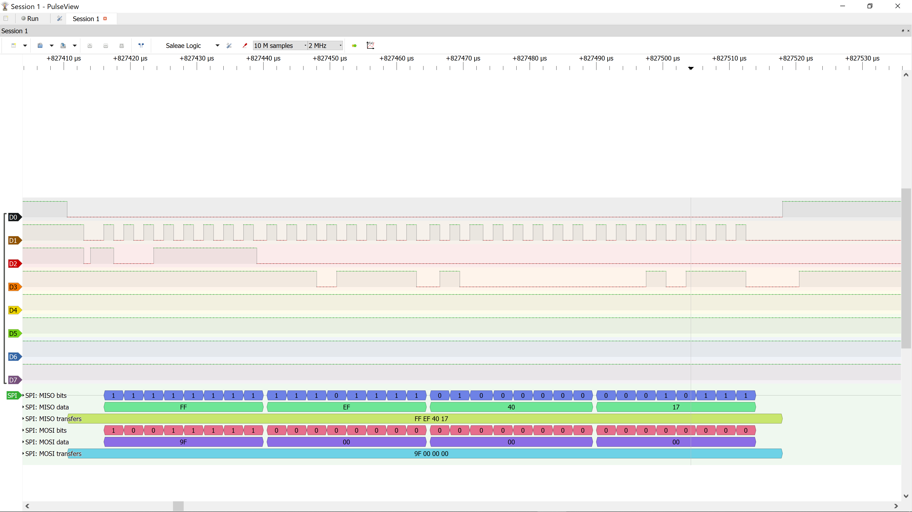

# Validation

## I2C — MPU6050 WHO_AM_I

- Tool: 24 MHz logic analyzer + PulseView, sample rate 2 MHz
- Bus: I2C1, SCL = PB8 (CH0), SDA = PB9 (CH1)
- I2C clock: ~100 kHz
- Address: 0x68 (write, then read)
- Register: 0x75 (WHO_AM_I)
- Returned value: 0x68
- Sequence: S, addr W, ACK, reg, ACK, Sr, addr R, ACK, data, NACK, P

## I2C — MPU6050 init (WHO_AM_I check + wake-up)

- Transaction 1: read WHO_AM_I (0x75) → 0x68
- Transaction 2: write PWR_MGMT_1 (0x6B) = 0x00 → clear SLEEP bit
- All bytes ACKed by sensor

## SPI1 — W25Q64 JEDEC ID (0x9F)

- Setup: SPI1 mode 0, prescaler 256 (≈328 kHz), CS = PB6 (software)
- Capture: PulseView, 2 MHz — D0 = CS, D1 = SCK, D2 = MOSI, D3 = MISO

| Line | Bytes |
|------|-------|
| MOSI | 9F 00 00 00 |
| MISO | FF EF 40 17 |

- Result: EF = Winbond, 40 17 = W25Q64 (64 Mbit) — matches datasheet
- SCK measured ≈330 kHz; idle LOW (mode 0)
- ~1 µs gap between bytes: HAL polling overhead (DMA planned in Block F)
- Negative test: MISO disconnected → `00 00 00` with HAL_OK
  → SPI has no ACK; driver must validate the ID itself

## SPI1 — W25Q64 Page Program / Read Data

[ẢNH: spi_w25q64_page_program.png]
- WREN `06` → CS high → `02 00 00 00 DE AD BE EF`
- CS rising edge between commands latches WEL

[ẢNH: spi_w25q64_busy_poll.png]
- 256-byte program: 6 polls SR1=`03` (BUSY+WEL), last poll `00`
- Measured tPP = 419 µs (±60 µs poll resolution); datasheet typ 0.4 ms, max 3 ms
- WEL clears automatically after program completes

[ẢNH: spi_w25q64_read_data.png]
- MOSI `03 00 00 00`, MISO returns `DE AD BE EF`
- MOSI during data phase = previous rx buffer content (HAL_SPI_Receive), ignored by flash

## W25Q64 — timing & pattern tests

| Item | Result |
|------|--------|
| Sector erase (4 KB) | 38–44 ms (datasheet typ 45, max 400) |
| Page program 4 B | < 60 µs (done before first poll) |
| Page program 256 B | 419 µs |
| Pattern 0x00 / 0x55 / 0xAA / incremental (256 B) | 4/4 PASS |
| Cross-page program (0xFE, len 4) | rejected, W25Q64_ERR_PARAM |
| Busy timeout path | ERR_TIMEOUT, SR1=03 (chip still busy) |
| MCU reset | WEL survives (flash stays powered) |