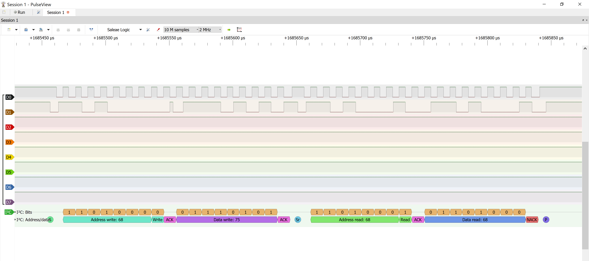
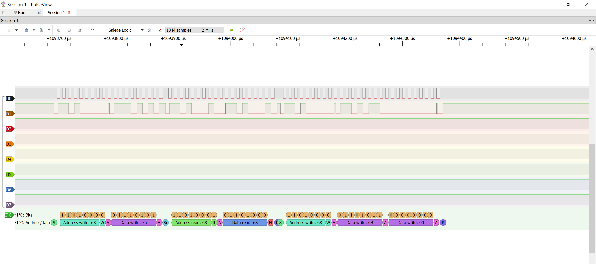

# Validation

## I2C — MPU6050 WHO_AM_I

- Tool: 24 MHz logic analyzer + PulseView, sample rate 2 MHz
- Bus: I2C1, SCL = PB8 (CH0), SDA = PB9 (CH1)
- I2C clock: ~100 kHz
- Address: 0x68 (write, then read)
- Register: 0x75 (WHO_AM_I)
- Returned value: 0x68
- Sequence: S, addr W, ACK, reg, ACK, Sr, addr R, ACK, data, NACK, P

## I2C — MPU6050 init (WHO_AM_I check + wake-up)

- Transaction 1: read WHO_AM_I (0x75) → 0x68
- Transaction 2: write PWR_MGMT_1 (0x6B) = 0x00 → clear SLEEP bit
- All bytes ACKed by sensor